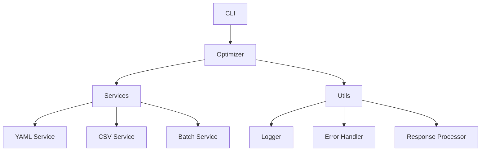

# Prompt Storm: Advanced Prompt Engineering Toolkit

[](https://opensource.org/licenses/MIT)
[](https://www.python.org/downloads/)
[](https://github.com/psf/black)

Prompt Storm is a powerful toolkit designed for sophisticated prompt engineering and optimization. It provides a comprehensive set of tools for creating, optimizing, and managing prompts at scale, making it an essential tool for AI developers and researchers working with language models.

## Table of Contents
- [Overview](#overview)
- [Features](#features)
- [Installation](#installation)
- [Quick Start](#quick-start)
- [Usage Guide](#usage-guide)
- [Architecture](#architecture)
- [API Reference](#api-reference)
- [Development](#development)
- [Advanced Topics](#advanced-topics)
- [Troubleshooting](#troubleshooting)
- [License](#license)

## Overview

Prompt Storm empowers developers to:
- Optimize prompts for better performance and consistency
- Process multiple prompts in batch mode
- Format prompts in standardized YAML format
- Track optimization progress with rich logging
- Handle errors gracefully with comprehensive error reporting

### Key Features
- **Intelligent Prompt Optimization**: Leverages advanced LLMs to enhance prompt effectiveness
- **Batch Processing**: Efficiently handle multiple prompts using CSV input
- **YAML Formatting**: Standardize prompts with structured YAML output
- **Progress Tracking**: Rich console output with detailed progress information
- **Error Handling**: Robust error management with helpful error messages

### Use Cases
- Optimizing prompts for chatbots and AI assistants
- Standardizing prompt formats across large projects
- Processing and converting legacy prompts to YAML format
- Batch optimization of prompt libraries
- Quality assurance for prompt engineering pipelines

## Installation

### Prerequisites
- Python 3.8 or higher
- pip package manager

### Basic Installation
```bash
pip install prompt-storm
```

### Development Setup
```bash
git clone https://github.com/yourusername/prompt-storm.git
cd prompt-storm
pip install -e ".[dev]"
```

### Dependencies
- click: Command line interface creation
- rich: Enhanced terminal output
- litellm: LLM interface
- pyyaml: YAML processing
- pandas: CSV handling

## Quick Start

### Basic Usage
Optimize a single prompt:
```bash
prompt-storm optimize "Write a story about a magical forest"
```

Process multiple prompts from a CSV file:
```bash
prompt-storm optimize-batch input.csv output_dir --prompt-column "prompt"
```

Format a prompt to YAML:
```bash
prompt-storm format-prompt "Generate a creative story" --output-file story.yaml
```

## Usage Guide

### Command Line Interface

#### optimize
Optimize a single prompt with customizable parameters:
```bash
prompt-storm optimize "Your prompt" \
    --model gpt-4o-mini \
    --max-tokens 2000 \
    --temperature 0.7 \
    --output-file optimized.yaml
```

Parameters:
- `--model`: LLM model to use (default: gpt-4o-mini)
- `--max-tokens`: Maximum tokens in response (default: 2000)
- `--temperature`: Generation temperature (default: 0.7)
- `--input-file`: Optional input file containing the prompt
- `--output-file`: Optional output file for the result
- `--verbose`: Enable detailed logging

#### optimize-batch
Process multiple prompts from a CSV file:
```bash
prompt-storm optimize-batch prompts.csv output/ \
    --prompt-column "prompt" \
    --model gpt-4o-mini \
    --language english
```

Parameters:
- `input-csv`: Path to input CSV file
- `output-dir`: Directory for output files
- `--prompt-column`: Name of CSV column containing prompts
- `--model`: LLM model to use
- `--language`: Target language for optimization

#### format-prompt
Convert a prompt to YAML format:
```bash
prompt-storm format-prompt "Your prompt" \
    --output-file formatted.yaml \
    --language english
```

### Configuration

Model configuration options:
```python
config = OptimizationConfig(
    model="gpt-4o-mini",
    max_tokens=2000,
    temperature=0.7,
    language="english"
)
```

## Architecture

### Component Overview



### Core Services

#### OptimizerService
Handles prompt optimization using LLMs:
```python
optimizer = OptimizerService(config)
result = optimizer.optimize("Your prompt")
```

#### YAMLService
Manages YAML formatting and validation:
```python
yaml_service = YAMLService(config)
yaml_output = yaml_service.format_to_yaml(prompt)
```

#### BatchOptimizerService
Processes multiple prompts efficiently:
```python
batch_service = BatchOptimizerService(
    optimizer_service=optimizer,
    yaml_service=yaml_service,
    csv_service=csv_service
)
```

## Development

### Project Structure
```
prompt_storm/
├── __init__.py          # Package initialization
├── cli.py              # Command line interface
├── optimizer.py        # Core optimization logic
├── models/            # Data models
│   ├── config.py
│   └── responses.py
├── services/          # Core services
│   ├── optimizer_service.py
│   ├── yaml_service.py
│   ├── csv_service.py
│   └── batch_optimizer_service.py
├── utils/            # Utility functions
│   ├── logger.py
│   ├── error_handler.py
│   └── response_processor.py
└── interfaces/       # Service interfaces
    └── service_interfaces.py
```

### Testing
Run the test suite:
```bash
pytest tests/
```

Write tests following the existing pattern:
```python
def test_optimize():
    optimizer = PromptOptimizer()
    result = optimizer.optimize("Test prompt")
    assert result is not None
```

### Contributing
1. Fork the repository
2. Create a feature branch
3. Make your changes
4. Run tests
5. Submit a pull request

## Advanced Topics

### Custom Configurations
```python
from prompt_storm.models.config import OptimizationConfig

config = OptimizationConfig(
    model="gpt-4o-mini",
    max_tokens=2000,
    temperature=0.7,
    language="english"
)
```

### Integration Example
```python
from prompt_storm import PromptOptimizer

optimizer = PromptOptimizer()

# Single prompt optimization
result = optimizer.optimize("Your prompt")

# Batch processing
with open('prompts.csv', 'r') as f:
    prompts = f.readlines()
    results = [optimizer.optimize(p) for p in prompts]
```

### Best Practices
1. Use appropriate temperature settings for your use case
2. Implement proper error handling
3. Monitor token usage
4. Validate YAML output
5. Use batch processing for large datasets

## Troubleshooting

### Common Issues

1. Rate Limiting
```python
try:
    result = optimizer.optimize(prompt)
except Exception as e:
    if "rate limit" in str(e).lower():
        time.sleep(60)  # Wait before retry
```

2. Invalid YAML Format
```python
try:
    yaml_output = yaml_service.format_to_yaml(prompt)
except YAMLValidationError as e:
    logger.error(f"YAML validation failed: {e}")
```

### Error Messages

- `Rate limit exceeded`: Wait a few minutes or upgrade API plan
- `Invalid YAML format`: Check prompt structure and formatting
- `Resource exhausted`: Reduce batch size or implement rate limiting
- `Invalid model`: Verify model name and availability

## License

This project is licensed under the MIT License - see the [LICENSE](LICENSE) file for details.

### Contributing

We welcome contributions! Please see our [Contributing Guidelines](CONTRIBUTING.md) for details.

### Credits

Developed by the Prompt Storm team. Special thanks to all contributors.
